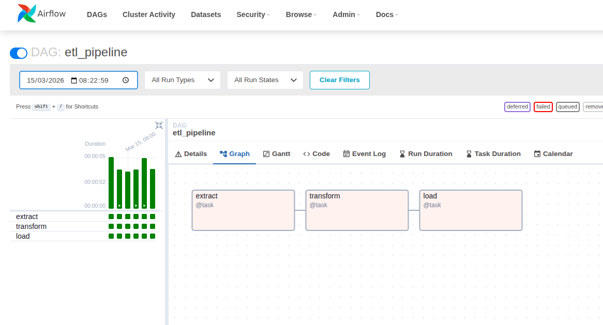
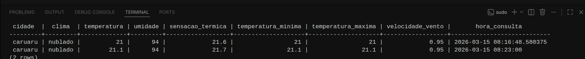

# 🌦️ Pipeline Climático

Pipeline ETL automatizado desenvolvido em **Python** que consome dados climáticos de uma API, orquestrado automaticamente e é executado a cada **uma hora**. Processa as informações e armazena os resultados em um banco de dados **PostgreSQL**, visando futura análise.

---

## Visão Geral 🗄️

Este projeto implementa um fluxo completo de **Extração, Transformação e Carga (ETL)**.

### Extract

Consome dados climáticos da API de clima para uma localização definida no arquivo `.env`.

### Transform

Seleciona e trata apenas os dados relevantes, organizando-os em um formato estruturado.

### Load

Armazena os dados processados em um banco de dados **PostgreSQL**.

---

## Tech Stack

* Python
* Apache Airflow
* PostgreSQL
* Docker e Docker Compose
* Pandas
* Requests
* SQLAlchemy

---

## Estrutura do Projeto

```
pipeline-automatizado
├── config/
│
├── dags/
│   └── etl-pipeline.py
│
├── src/
│   ├── __init__.py
│   ├── extract.py
│   ├── transform.py
│   └── load.py
│
├── logs/
├── docker-compose.yml
├── requirements.txt
└── .env
```

---

## Funcionalidades ⚒️ 

* Consumo automático de API de clima
* Pipeline ETL modular em Python
* Execução automática a cada **1 hora**
* Armazenamento em **PostgreSQL**
* Orquestração com **Apache Airflow**
* Containerização com **Docker**
* Tratamento de erros com envio de **email em caso de falha**

---

## Dados Armazenados

O pipeline salva informações como: 🌥️

* Cidade
* Clima
* Temperatura
* Sensação térmica
* Umidade
* Temperatura mínima
* Temperatura máxima
* Velocidade do vento
* Horário da consulta

---

## Executando o Projeto 💻

### 1. Clonar o repositório

```
git clone https://github.com/seu-usuario/seu-repo.git
cd seu-repo
```

### 2. Criar o arquivo `.env`

Criar o arquivo `.env` seguindo o modelo do `example.env`.

### 3. Criar o arquivo `docker-compose.yaml`

Crie o seu próprio docker-compose e configure ele como preferir.
(Padrão do jeito que está ele já funciona desde que você coloque corretamente as variáveis do .env)

### 4. Ajustar permissões do container do Airflow

Isso impede que erros de permissão acontecam ao iniciar o airflow-init:

```
sudo chown -R 50000:0 dags logs plugins
sudo chmod -R 775 dags logs plugins
```

### 5. Subir os containers

```
docker compose up airflow-init
docker compose up
```

### 6. Acessar o Airflow

```
http://localhost:8080
```

**User:** admin
**Password:** admin

---

### 7. Acessar o Airflow

Orquestre do seu próprio jeito, faça seus testes e sinta-se livre pra modificar o projeto!


### 8. Acessar o Banco de Dados

No terminal, digite:
```
docker compose exec postgres psql -U airflow -d airflow
```
```
SELECT * FROM dados_clima
```



Projeto desenvolvido para fins de **estudo e prática em Engenharia de Dados**.

Se este projeto te ajudou ou inspirou, considere dar uma estrela no repositório. ⭐
